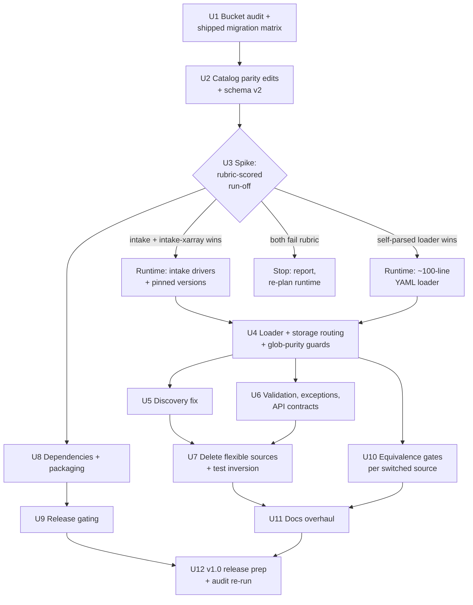
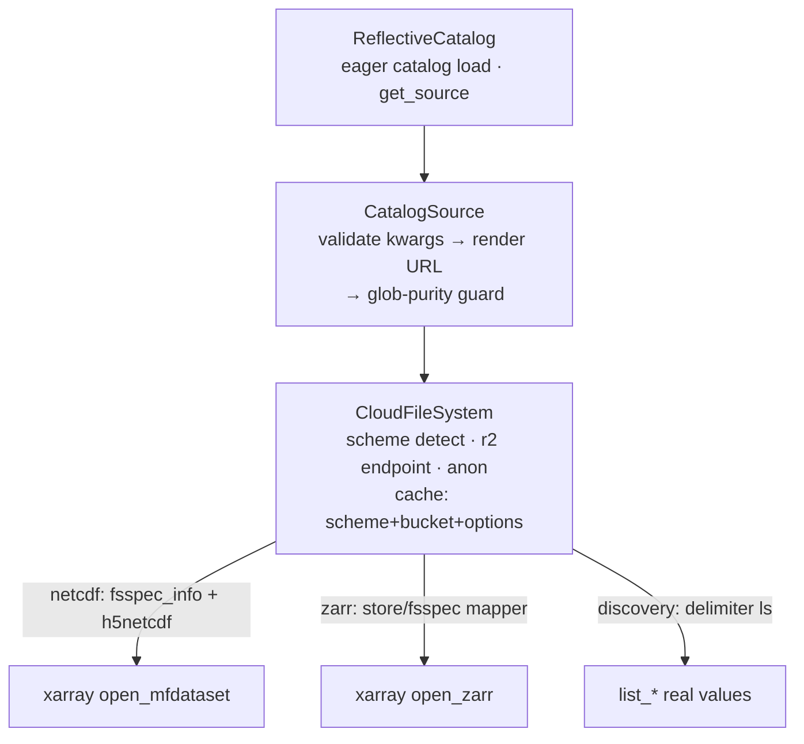

# YAML Catalog Migration for v1.0 - Plan

---

## Goal Capsule

- **Objective:** Ship reflective-data-catalog v1.0 with `src/reflective_data_catalog/data-catalog.yaml` as the sole source-registration mechanism, the FlexibleSource system removed, zarrified sources loading from their R2/AWS copies, and the public API frozen deliberately.
- **Authority hierarchy:** This plan > repo conventions (`pyproject.toml` ruff config, snake_case modules) > incidental patterns in existing code. Product behavior is owned by the R-IDs; implementation mechanism by the KTDs.
- **Stop conditions:** (1) The U1 bucket audit shows no Zarr copies exist for `cesm2_waccm_historical`/`cesm2_waccm_ssp245` AND their NetCDF layout cannot be expressed in the YAML schema — stop and surface. (2) Both spike candidates fail the U3 rubric — stop and report rather than picking the less-bad one. (3) Any change would silently alter what data a documented call returns without the R12 guidance error — stop; that is the class of bug this migration exists to prevent.
- **Execution profile:** Phased; U1-U3 are sequential gates, later units parallelize. Real-bucket steps (U1, U10, U12 re-audit) need Reflective Hub credentials — surface a credential request rather than skipping.
- **Tail ownership:** Tagging and publishing v1.0 (U12) is a user action; the executor prepares but never pushes the tag.

---

## Product Contract

### Summary

Make the packaged YAML catalog the single way sources are registered, delete the two-system dispatch, and decide the runtime (intake drivers vs a small self-parsed loader) by a rubric-scored spike before committing. Fold in the v1.0 launch blockers: declared dependencies, R2-capable Zarr loading with real store discovery, kwarg validation with a canonical vocabulary plus aliases, typed exceptions, inverted test strategy, gated releases, and a docs overhaul with a migration guide.

### Problem Frame

The package currently runs two parallel source systems: 8 `FlexibleSourceConfig` entries in `src/reflective_data_catalog/reflective_data.py` (checked first by `__getattr__`) and 17 intake-YAML entries in `src/reflective_data_catalog/data-catalog.yaml` (fallback, currently failing to instantiate on any clean install because `intake-xarray` is undeclared). The flexible system carries the recent bug streak (lazy-loading fixes, MIROC variant guard, wildcard path fix); the YAML side is broken but never exercised — every test mocks it. Several models now have zarrified copies split across Cloudflare R2 and AWS. A pressure-tested adoption verdict (Trial) settled the direction: one YAML registration format, runtime decided by a spike, self-parsed loader as leading candidate. v1.0 freezes names and semantics, so parity, value vocabularies, and error contracts must be settled now — they are unfixable after launch.

### Requirements

**Catalog and parity**

- R1. `data-catalog.yaml` is the only source-registration mechanism at v1.0; `flexible_sources.py` and `reflective_data.py` are removed.
- R2. The 8 documented source names (`cesm2_waccm_g6_1p5k_hilla`, `cesm2_waccm_historical`, `cesm2_waccm_ssp245`, `e3smv3_g6_1p5k_hilla`, `miroc_es2h_g6_1p5k_hilla`, `miroc_es2h_g6_1p5k_sai`, `ukesm1_g6_1p5k_hilla`, `ukesm1_ssp245`) resolve via `catalog.<name>` identically before and after migration — YAML entries are renamed to these names; no `_zarr` suffixes; no parenthesized entry names anywhere in the catalog.
- R3. Every catalog entry instantiates, and its default-rendered URL exists in cloud storage, verified against the U1 bucket inventory (the current YAML defaults are known-wrong in places: e3sm member `r1i1p1f1` vs the real `0101`, UKESM `r1i1p1f2` vs `r12i1p1f2`).
- R4. `cesm2_waccm_historical` and `cesm2_waccm_ssp245` exist as catalog entries backed by their zarrified copies. The NetCDF-fallback disposition is general: any source whose Zarr copy is absent (U1) or fails its equivalence gate (U10) ships its NetCDF entry preserving today's paths and mappings.
- R5. Every multi-file entry's rendered glob is selection-pure: it matches exactly the fileset of one (ensemble, variant, table, variable, stream) selection. Known violations to fix: the MIROC glob has no ensemble token (matches every member); the CESM `.cam.*.{variable}.*.nc` / `.pop.*.` wildcards span the history-stream token, combining monthly and daily files.
- R6. Zarr-backed sources load from both R2 and AWS buckets; which bucket backs which source comes from the U1 inventory (settled: the copies are mixed across both).

**Loading and discovery**

- R7. A clean `pip install reflective-data-catalog` loads every public entry: all runtime dependencies declared; heavy ESM/ESGF stacks become optional extras with friendly ImportError guidance.
- R8. All data opens — Zarr included — route through the shared filesystem configuration: `r2://` URLs resolve via the R2 endpoint, and per-entry anonymous access (`storage_options.anon`) is honored for both opens and discovery (today public buckets fail discovery because obstore stores are built bare, `src/reflective_data_catalog/storage.py:174`).
- R9. `list_ensembles`/`list_tables`/`list_variables` return real scanned values for Zarr stores; an empty scan returns `[]` with a warning — never the silent parameter-default fallback that today makes `discover()` print fiction (`src/reflective_data_catalog/main.py:302-319`).
- R10. `read()` returns loaded data and `to_dask()` returns lazy data on every driver (today `read()` on a Zarr source silently returns lazy data, `src/reflective_data_catalog/main.py:586-588`).

**API freeze**

- R11. Canonical kwargs are `ensemble`/`table`/`variable`, with permanent aliases `ensemble_member`, `member_id`, `table_id`, `variable_id`; per-entry extra parameters (`variant`, `time`, `realm`, `time_frequency`, `version`) are whitelisted from the entry's declared parameters; any other kwarg raises `TypeError` (today `varaible='SALT'` silently loads the default variable). The `TypeError` message consults the U1 matrix so removed or redirected kwargs get a pointer, not a bare rejection.
- R12. A documented call whose old parameter *value* no longer matches the new backend (e.g. `table='AMON'`, `variable='T'`, `ensemble='r1'` against a Zarr entry keyed `Aday`/`tas`/`r1i1p1f1`) raises a guidance error carrying the old→new mapping from the U1 migration matrix — values are never silently translated.
- R13. Typed exception hierarchy (`CatalogError`, `SourceNotFoundError`, `DataNotFoundError`) with chained causes. The catalog file loads eagerly at construction (it ships in the wheel — a corrupt catalog fails at `ReflectiveCatalog()` as `CatalogError`); `__getattr__` keeps pure `AttributeError` semantics (`SourceNotFoundError` subclasses `AttributeError`) so `hasattr`, three-arg `getattr`, and notebook tab-completion keep working.
- R14. Listing and search return structured data (printing moves behind a `verbose` flag); every `search()` result carries its `kind`, and every result with `kind == "entry"` resolves through `get_source()` — ESM/ESGF rows stay in results, carry their kind, and are exempt from resolvability. `get_parameters()` on an unknown name raises `SourceNotFoundError`.
- R15. `get_source(name)` provides string-keyed (and the typed — `py.typed` ships) access to any entry; `__all__` exports the public surface deliberately, keeping `ESMCatalog`, `GeoMIPCloudHelper`, and `__version__` (currently exported; dropping them would be an unrecorded break).

**Quality**

- R16. Tests use the real registration path plus the real shipped `data-catalog.yaml`, mocking storage I/O only; CI instantiates every catalog entry unmocked; coverage is enforced with `--cov-fail-under=70`.
- R17. Every source whose backend switches NetCDF→Zarr passes an adversarial equivalence gate (see U10) before its Zarr entry ships; the per-source report is published in the migration notes.

**Release, docs, and schema**

- R18. Publishes gate on green tests: TestPyPI only from `main`, PyPI only from a tagged release whose workflow depends on the test job; the release workflow verifies the wheel contains `data-catalog.yaml` and the machine-readable migration matrix, and import-smokes the built wheel.
- R19. Docs ship a credentials matrix (public / hub-only / R2, including `CLOUDFLARE_R2_ACCOUNT_ID`), a migration guide rendered from the U1 disposition matrix, a rewritten CONTRIBUTING "Adding a New Data Source" (YAML workflow), a corrected README (drop the nonexistent `cesm2_waccm6_g6_1p5k_hilla` row, fix the `Example.ipynb` link), and a refreshed repo `CLAUDE.md` (it still names `flexibleSources.py`).
- R20. v1.0 is tagged with a CHANGELOG entry and the Development Status classifier bumped from Beta.
- R21. The catalog schema is versioned: `metadata.version` bumps to 2 with the entry renames; the loader asserts the version it understands; custom fields (`value_map`, `data_access`) live under entry `metadata` blocks so intake-v1 parsers tolerate them.

### Acceptance Examples

- AE1. **Covers R11.** Given a clean install, when a user calls `catalog.cesm2_waccm_ssp245(varaible='SALT')`, then a `TypeError` names `varaible` as unknown and lists the valid parameters — no data loads.
- AE2. **Covers R12.** Given the migrated Zarr-backed `cesm2_waccm_g6_1p5k_hilla`, when a user calls it with `table='AMON'` (the old NetCDF vocabulary), then the error names the entry, states `AMON` is not available, and points to `Amon`/`Aday` and the migration guide.
- AE3. **Covers R9.** Given a Zarr entry whose rendered scan matches nothing, when `list_variables()` runs, then it returns `[]` and warns — `discover()` never prints parameter defaults as scan results.
- AE4. **Covers R8.** Given `CLOUDFLARE_R2_ACCOUNT_ID` unset, when a user loads an R2-backed source, then the raised error names the env var — not a botocore stack trace.
- AE5. **Covers R2, R11.** Given the migrated catalog, when a user runs the README-documented `catalog.miroc_es2h_g6_1p5k_hilla(variant='baseline')`, then baseline data loads — the documented kwarg survives the migration.

### Scope Boundaries

**Deferred to follow-up work**

- GAUSS entry path fix (`## TO DO - fix paths`, `data-catalog.yaml:438`) — needs the data owner's layout knowledge; the entry is excluded from the R3 existence gate and marked experimental in metadata until fixed.
- `allowed`-value lists on every entry (R11 validates names lazily at open; enumerating values per entry needs a staleness policy vs the buckets).
- Surfaced `data_access` metadata per entry shown in `list_sources` — nice-to-have; add if U11 has room.

**Outside this plan**

- New science sources beyond parity; zarrification pipelines (data engineering, not this package — but see the bucket-drift risk they create).
- `esm.py`/`esgf.py` feature work beyond the duplicate-instance cleanup in U6.
- Migration to intake-esm asset tables or STAC — recorded fallback (see KTD9 reversal note), not v1.0 work.

---

## Planning Contract

### Key Technical Decisions

- KTD1. **Single YAML registration file; flexible sources deleted.** (session-settled: user-approved — chosen over keeping both systems: dual dispatch produced four parameter vocabularies, a silent priority order, and the recent bug streak.) Governs R1, R2.
- KTD2. **Runtime decided by the U3 spike under a pinned six-point rubric; the self-parsed loader is the leading candidate.** (session-settled: user-approved — chosen over adopting intake's drivers outright: the driver path is broken on a clean install, intake v2 is self-labeled beta, the adapter already bypasses intake templating and reaches into seven private attributes.) The spike decides the *runtime only* — the storage layer is pinned by KTD7. Governs R7, R10.
- KTD3. **Public names are the YAML entry names.** (session-settled: user-approved — chosen over `_zarr`-suffixed names: v1.0 must not rename the documented API.) Entries are renamed in place; the two parenthesized names were never reachable and are not a compat surface. Governs R2.
- KTD4. **Canonical kwargs plus permanent aliases.** (session-settled: user-approved — chosen over a single-vocabulary hard break: friendlier to CMIP6 users at the cost of two names per concept.) Canonical set is `ensemble`/`table`/`variable`; aliases normalize at the source-object boundary; per-entry parameters extend the whitelist. Governs R11.
- KTD5. **Old values error with guidance; never silent translation.** For a science catalog, a wrong-dataset load is worse than a hard error. The migration matrix is the single owner of old→new name, kwarg, and value dispositions — and it ships as a machine-readable file inside the package (an installed wheel cannot read repo `docs/`); `docs/migration-matrix.md` and the U11 guide are rendered from it, and CI cross-checks every mapped value against the bucket inventory. Governs R11, R12, AE2, AE5.
- KTD6. **Discovery uses delimiter-based listing at the rendered template depth, not prefix-list-plus-fnmatch.** A Zarr store is a prefix; matching object keys against `*.zarr` returns nothing after listing potentially millions of chunk keys (`src/reflective_data_catalog/storage.py:198-212`). `CloudFileSystem.ls` (`list_with_delimiter`) already exists as the primitive. Empty results propagate as `[]` + warning. Governs R9.
- KTD7. **Storage layer pinned: obstore stays the store/discovery backend; fsspec is used only at the xarray handoff via `fsspec_info()`.** This matches the working netcdf path and removes a hidden either-way branch from U4/U7/U8 scoping. R2 sources keep `r2://` URLs resolved via `CLOUDFLARE_R2_ACCOUNT_ID` (chosen over embedding the account's endpoint in the published YAML; revisit if the audit finds R2-hosted *public* data). Per-entry `storage_options` are honored by: (1) keying the store cache on (scheme, bucket, frozen per-entry options) — today's `scheme://bucket` key (`storage.py:139,163-176`) lets the first entry to touch a bucket fix the config for all later entries; (2) one named translation point mapping YAML `storage_options` to both vocabularies (fsspec `anon` ↔ obstore `skip_signature`); (3) a documented fs lifecycle — env vars are read once at catalog construction. Governs R6, R8.
- KTD8. **The YAML schema stays an intake-v1-compatible subset, governed, regardless of the spike outcome**: `sources:` map, `driver: zarr|netcdf`, `args.urlpath` with plain `{{param}}` substitution, `parameters` with type/default/description, `metadata`. `metadata.version` bumps to 2 with the renames and the loader asserts it (R21); custom fields live under entry `metadata`; an extras-gated intake-load smoke test in `tests/test_catalog_entries.py` keeps the compat claim verified even if intake leaves the core install. Governs R4, R21.
- KTD9. **Reversal trigger (carried from the adoption verdict):** if the chosen runtime fights back post-spike — intake v2 API churn, or the self-parsed loader growing past ~300 lines to reach parity — the fallback is an intake-esm-style asset table for the model data; the YAML format outlives either runtime.
- KTD10. **Test inversion:** delete the `sys.modules["intake"]` wholesale mock (`tests/conftest.py:268`); tests run the real registration path against the real shipped YAML with storage I/O mocked at the `CloudFileSystem` boundary; `tests/conftest.py` is updated in the same commit that deletes `flexible_sources.py` (it imports it at line 12 — the whole suite dies at collection otherwise). Governs R16.
- KTD11. **One source class, cleanly layered.** `CatalogSource` exposes exactly the surface both `FlexibleSource` and `IntakeSource` share today (`to_dask`, `read`, `url`, `urlpath`, `config`, `list_ensembles`, `list_tables`, `list_variables`, `discover`); `IntakeSource`'s template scan machinery (`src/reflective_data_catalog/main.py:105-192`) is lifted, not rewritten — but the lifted code calls `self._catalog.fs` (`main.py:176`), so `CatalogSource` is constructor-injected with the shared `CloudFileSystem`, never the catalog (avoids a loader↔main import cycle). Import DAG: `exceptions.py ← storage.py ← loader.py ← main.py ← __init__.py`, no back-edges; near-match suggestions are computed at the raise site, keeping `exceptions.py` a leaf. `get_source_config()` and the `is_flexible` key are removed (implementation-type leaks); `get_parameters()` unifies on one schema — `{name, driver, description, parameters}` — which `show_parameters` renders; `__dir__` drops the flexible branch and `get_source_config`, gains `get_source`.

### High-Level Technical Design

Migration flow with the spike gate:

Target load path (all drivers, both clouds):

The diagrams are directional; unit bodies are authoritative.

### System-Wide Impact

- **Search and helper surfaces:** `search()` today mixes catalog entries, ESM pseudo-keys (`"GeoMIP.CESM2-WACCM.G6sulfur"`, `main.py:1085-1094`), and ESGF method names (`main.py:1103-1154`). R14's `kind` field keeps those rows without pretending they resolve. The `esm`/`geomip_cloud`/`esgf` attributes are otherwise untouched.
- **Export/typing freeze:** `__all__` keeps `ESMCatalog`, `GeoMIPCloudHelper`, `__version__` (R15); `py.typed` makes annotations contract — `get_source()` is the typed access path since `__getattr__` dispatch is invisible to type checkers.
- **External YAML consumers:** anyone opening the shipped catalog with intake directly experiences the U2 renames as a break — `metadata.version: 2` plus the migration guide is their signal (R21).
- **Caching lifecycle:** three caches survive the migration — per-source discovery cache (session-scoped, `refresh=True` bypass), the eager catalog load (construction-scoped), and the `CloudFileSystem` store cache (now keyed with per-entry options, KTD7). Env vars are read once at catalog construction; documented.
- **help_text.py** becomes generated-from-catalog (U11), removing the drift channel that produced the phantom README source.

### Assumptions

- The Reflective Hub credentials available to the maintainer can list every bucket the catalog references (U1, U10, and the U12 re-audit depend on this).

---

## Risks & Dependencies

| Risk | Failure path | Mitigation / verification |
|---|---|---|
| Partial or stale Zarr stores | Zarr reads missing chunks as fill values (NaN) by design; stale consolidated metadata describes arrays that changed — a truncated copy passes structural checks and fabricates data silently | U1 records per-store format version, consolidated presence, and a chunk-completeness count (metadata grid vs listed keys, no downloads); U10's gate slices the *end* of the time range and array corners and compares NaN fraction vs the NetCDF original; failing sources ship NetCDF (R4) |
| Bucket drift after the audit | Zarrification continues in parallel (out of scope); a store moves or lands between U1 and the tag; every gate stays green because CI verifies against the U1 snapshot | The audit is a committed, rerunnable script with timestamped output; U12 re-runs it and diffs before the tag; any diff re-opens the affected U2/U10 rows |
| zarr-python 2 vs 3 divergence | zarr-python 2 cannot read format-3 stores; consolidated-metadata behavior differs across the boundary — user installs resolve a different major than the spike validated | U8 declares version bounds derived from the U3 rubric-5 freezes and the store formats U1 recorded (any format-3 store forces the v3 floor); rubric 4 fixes expected `consolidated=True`-vs-unconsolidated behavior |
| intake v2 beta churn (if intake wins U3) | A minor release breaks entry internals the adapter touches | Pin intake/intake-xarray ranges; KTD9 reversal path stands |
| Migration-matrix drift | Error guidance points at values that no longer exist in the buckets | Matrix ships in the wheel; CI cross-checks every mapped value against `bucket_inventory.json` (KTD5) |
| Credential dependency | U1/U10/U12 need hub credentials and the R2 account ID; silently skipping them guts the verification story | Named execution notes; the executor surfaces a credential request rather than proceeding |

---

## Implementation Units

| U-ID | Title | Key files | Depends on |
|---|---|---|---|
| U1 | Bucket audit + shipped migration matrix | scripts/bucket_audit.py, src/reflective_data_catalog/migration_matrix.yaml, docs/migration-matrix.md, tests/fixtures/bucket_inventory.json | — |
| U2 | Catalog parity edits + schema v2 | src/reflective_data_catalog/data-catalog.yaml | U1 |
| U3 | Runtime spike (rubric-scored) | tests/test_catalog_entries.py, docs/spike-runtime-decision.md | U2 |
| U4 | Loader + storage routing + glob-purity guards | src/reflective_data_catalog/{main.py,storage.py,loader.py} | U3 |
| U5 | Discovery fix | src/reflective_data_catalog/{storage.py,loader.py} | U4 |
| U6 | Validation, exceptions, API contracts | src/reflective_data_catalog/{main.py,exceptions.py,__init__.py} | U4 |
| U7 | Delete flexible sources + test inversion | src/reflective_data_catalog/, tests/ | U5, U6 |
| U8 | Dependencies + packaging | pyproject.toml | U3 |
| U9 | Release gating | .github/workflows/ | U8 |
| U10 | NetCDF→Zarr equivalence gates | docs/migration-notes/ | U4 |
| U11 | Docs overhaul | README.md, CONTRIBUTING.md, CLAUDE.md, Example.ipynb, help_text.py | U7, U10 |
| U12 | v1.0 release prep + audit re-run | CHANGELOG.md, pyproject.toml | U9, U11 |

### U1. Bucket audit and shipped migration matrix

- **Goal:** Convert every unknown this plan depends on into recorded, re-checkable data: what exists in which bucket under which keys, and how each old name/kwarg/value maps forward.
- **Requirements:** R3, R4, R6, R11, R12.
- **Dependencies:** none — this is the first work and gates everything.
- **Files:** `scripts/bucket_audit.py` (committed, rerunnable, timestamped output), `tests/fixtures/bucket_inventory.json`, `src/reflective_data_catalog/migration_matrix.yaml` (machine-readable, wheel-packaged — the single owner per KTD5), `docs/migration-matrix.md` (rendered from it).
- **Approach:**
  1. The audit script renders every current and planned entry's default URL and delimiter-lists it; records existence and the actual key vocabulary (settling `0101` vs `r1i1p1f1`, `r12i1p1f2` vs `r1i1p1f2`).
  2. Per Zarr store: format version (v2/v3), consolidated-metadata presence, chunk-completeness count (expected grid from metadata vs listed chunk keys — listing only, no downloads). Per multi-file entry: default-render match count and the parsed facet components of matched keys (reuse the template regex, `main.py:105-125`).
  3. Locate the zarrified copies for the 8 public sources (settled: mixed across R2 and AWS); record `r2://` or `s3://` per source (KTD7).
  4. Author the matrix: one row per old name/kwarg/value → disposition (keep / redirect / error-with-guidance / absorbed). Kwarg-level dispositions included — `variant` and `time` are documented kwargs, not just values.
- **Execution note:** Needs Reflective Hub credentials and the R2 account ID; surface a request rather than skipping. Fixtures, script, and matrix only — no `src/` behavior changes beyond adding the packaged matrix file.
- **Test scenarios:**
  - CI cross-fixture test: every "new" value in the matrix exists in `bucket_inventory.json`; every switched source has mapping rows for each renamed facet.
- **Verification:** Every planned catalog entry has an inventory row; the matrix parses and round-trips into the docs rendering.

### U2. Catalog parity edits and schema v2

- **Goal:** Make `data-catalog.yaml` complete and truthful before it becomes the source of truth.
- **Requirements:** R2, R3, R4, R5, R21; KTD3, KTD8.
- **Dependencies:** U1.
- **Files:** `src/reflective_data_catalog/data-catalog.yaml`.
- **Approach:**
  1. Rename entries to the 8 public names (drop `_zarr` suffixes; `miroc_g6_1p5k_hilla`→`miroc_es2h_g6_1p5k_hilla`, `miroc_g6_1p5k_sai`→`miroc_es2h_g6_1p5k_sai`; resolve `ukesm1_ssp245_g6_1p5k_hilla` vs the documented `ukesm1_ssp245` per the matrix).
  2. MIROC baseline canonical form: the `variant` parameter on the two MIROC entries (matching the documented API, AE5); the two parenthesized standalone baseline entries are absorbed into them and recorded in the matrix — one address per dataset, not two.
  3. Add `cesm2_waccm_historical` and `cesm2_waccm_ssp245` per the U1 inventory (Zarr expected; NetCDF fallback per R4).
  4. Correct defaults against the inventory (e3sm member, UKESM member, per-entry table defaults that fail their own descriptions); fix glob selection-purity per R5 (ensemble tokens, stream tokens).
  5. Remove `consolidated: true` from `driver: netcdf` entries; normalize `xarray_kwargs.engine` to `h5netcdf` (netcdf4 cannot read fsspec objects); mark GAUSS experimental (scope boundary).
  6. Bump `metadata.version` to 2; move any custom fields under entry `metadata` (R21).
- **Patterns to follow:** existing entry shape in `data-catalog.yaml:12-47`; the intake-v1-compatible subset (KTD8).
- **Test scenarios:**
  - Every entry name is a valid Python identifier.
  - Every entry's rendered default URL matches its `bucket_inventory.json` row; multi-file entries' match sets equal the recorded fixture sets (not just token presence).
  - No `driver: netcdf` entry carries `consolidated`; catalog `metadata.version == 2`.
- **Verification:** The U3 golden-file test consumes this catalog and passes its rendering cases.

### U3. Runtime spike (rubric-scored)

- **Goal:** Decide the runtime — intake+intake-xarray drivers vs a self-parsed YAML loader — on evidence, identically scored.
- **Requirements:** R7, R10; KTD2.
- **Dependencies:** U2.
- **Files:** `tests/test_catalog_entries.py` (permanent — becomes the R16 unmocked entry test and carries the extras-gated intake-compat smoke per KTD8), `docs/spike-runtime-decision.md` (the scored decision record).
- **Approach:** Build both candidates minimally and score them on the pinned rubric:
  1. **Enumeration** — all entries listed, gettable, valid identifiers.
  2. **Golden-file rendering** — default URL AND one override per entry match recorded expectations, including the 2-element urlpath list on `arise_15_cesm2_waccm_ssp245`.
  3. **Real reads** — one unmocked `to_dask()` per (driver × cloud backend) present in the catalog, using public anonymous data where possible (`ukesm1_arise_sai` NetCDF; Zarr and R2 targets from the U1 inventory); `read()` returns loaded data (R10).
  4. **Error contract** — unknown kwarg raises `TypeError`; missing credentials raise a typed, named error; `consolidated=True` against an unconsolidated store fixture behaves as pinned; both candidates pass the same cases.
  5. **Clean-venv freezes** — recorded `pip freeze` on Python 3.11 and 3.13, pinning zarr-python major and consolidated-metadata semantics.
  6. **Footprint** — dependency count and import time per candidate.
- **Execution note:** Timebox to roughly two days; the decision record is the deliverable. Score both candidates before reading either's score. The storage layer is pinned by KTD7 and is not part of this decision.
- **Test scenarios:**
  - The rubric cases above, written once, parameterized over both candidates; rubric 1-2 run with no network or credentials — they live in CI permanently.
- **Verification:** `docs/spike-runtime-decision.md` records per-criterion scores and names the winner; the losing candidate's code is deleted in U4 (Definition of Done cleanup rule).

### U4. Loader, storage routing, and glob-purity guards

- **Goal:** One source class on the winning runtime, all opens routed through the shared filesystem config, R2 and anonymous access working, over/under-matching globs caught at runtime.
- **Requirements:** R5, R6, R8, R10; KTD7, KTD11.
- **Dependencies:** U3.
- **Files:** `src/reflective_data_catalog/loader.py` (new `CatalogSource`), `src/reflective_data_catalog/main.py` (dispatch), `src/reflective_data_catalog/storage.py` (options-aware store cache, anon plumbing, zarr store handoff).
- **Approach:**
  1. Lift `IntakeSource`'s template render/scan machinery (`main.py:105-220`) into `CatalogSource`; constructor-inject the shared `CloudFileSystem`, never the catalog (KTD11 import DAG: `exceptions ← storage ← loader ← main ← __init__`, no back-edges).
  2. Route Zarr opens through `CloudFileSystem` — `fsspec_info()` already translates `r2://` to s3+endpoint (`storage.py:294-329`); today's `xr.open_zarr(url)` calls at `main.py:588,634` never reach it.
  3. Store cache keyed on (scheme, bucket, frozen per-entry options); one translation point maps YAML `storage_options` to obstore (`skip_signature`) and fsspec (`anon`) vocabularies, for opens AND discovery (KTD7).
  4. Runtime glob-purity guard (R5): after glob, parse matched filenames with the template regex and assert one value per non-wildcarded facet (member, stream, variant); after combine, assert a monotonic time axis; on violation raise `DataNotFoundError`-family — and never silently degrade a multi-file entry to a single-file open (today `main.py:485-490` does).
  5. Fix `read()`-returns-lazy on Zarr (R10); keep h5netcdf/scipy engine handling; preserve lazy in-method imports (the test strategy depends on them).
- **Patterns to follow:** `IntakeSource` (`main.py:14-322`) is the surface template; `tests/test_catalog.py:353-369` encodes a real ARISE bucket layout for fixtures.
- **Test scenarios:**
  - `to_dask()` lazy vs `read()` loaded on both drivers (mock storage).
  - `r2://` open with account ID set → correct endpoint; unset → error naming `CLOUDFLARE_R2_ACCOUNT_ID` (AE4).
  - `anon: true` entry → unsigned access reaches the storage layer for open and discovery; two entries with different options on the same bucket get distinct stores (cache-key test).
  - Glob purity: a mocked match set mixing `h0` and `h1` stream files → `DataNotFoundError`, no combine; a single-file match on a multi-file entry → error, not silent degrade; non-monotonic combined time → error.
  - Multi-file combine honors `combine`/`concat_dim` entry args.
- **Verification:** U3's real-read matrix passes on the shipped implementation, not just the spike harness.

### U5. Discovery fix

- **Goal:** `list_*` returns what is actually in the bucket, cheaply, for Zarr and NetCDF templates.
- **Requirements:** R9; KTD6.
- **Dependencies:** U4.
- **Files:** `src/reflective_data_catalog/storage.py`, `src/reflective_data_catalog/loader.py`.
- **Approach:** Replace scan-by-glob with delimiter listing at the rendered template depth (`ls` / `list_with_delimiter`): render the URL up to the parameter being scanned, list one level, filter (e.g. strip `.zarr` suffixes for store names). Never prefix-list an entire experiment tree to fnmatch object keys. Empty scan → `[]` + `warnings.warn`; the `_values_for` parameter-default fallback is deleted from scan paths. Cache keys include every parameter that shapes the rendered path (the current cache omits `time`).
- **Test scenarios:**
  - Zarr store discovery: mocked delimiter listing with `tas.zarr/`, `pr.zarr/` prefixes → `['pr', 'tas']`.
  - Empty listing → `[]` + warning; `discover()` prints `n/a`, never a default (AE3).
  - Listing calls are bounded: one delimiter list per scanned level (assert on mock call args).
  - Cache: same params hit cache; `refresh=True` and changed `time` bypass it.
- **Verification:** Against the recorded U1 inventory fixtures, discovery returns the observed vocabulary for at least one Zarr and one NetCDF source.

### U6. Validation, exceptions, and API contracts

- **Goal:** Freeze the public API deliberately: strict kwargs, typed errors that keep protocol semantics, structured returns, deliberate exports.
- **Requirements:** R11, R12, R13, R14, R15; KTD4, KTD5, KTD11.
- **Dependencies:** U4.
- **Files:** `src/reflective_data_catalog/exceptions.py` (new leaf module), `src/reflective_data_catalog/main.py`, `src/reflective_data_catalog/loader.py`, `src/reflective_data_catalog/__init__.py`.
- **Approach:**
  1. Kwarg validation at source construction: canonical trio + aliases normalized at the boundary + the entry's declared parameters; anything else → `TypeError` (AE1) whose message consults the shipped matrix for removed/redirected kwargs (R11 — `variant`/`time` redirects get pointers, not bare rejections).
  2. Old-value guidance errors from the shipped matrix (R12/AE2), checked before any storage call where possible.
  3. `exceptions.py`: `CatalogError`, `SourceNotFoundError(AttributeError)`, `DataNotFoundError`; `raise ... from e` throughout. The catalog loads eagerly in `__init__` (R13) so `__getattr__` raises only `SourceNotFoundError` — `hasattr`/tab-completion semantics survive; near-match suggestions computed at the raise site.
  4. `list_sources`/`list_tags`/`search` return structured records (`{name, kind, driver, tags}`), printing behind `verbose=True`; results with `kind == "entry"` resolve via `get_source()` (R14); `get_parameters()` raises `SourceNotFoundError` on unknown names and unifies on `{name, driver, description, parameters}` (KTD11), which `show_parameters` renders.
  5. `get_source(name)` added; `__all__` = `ReflectiveCatalog`, `CatalogSource`, `CloudFileSystem`, `ESMCatalog`, `GeoMIPCloudHelper`, exceptions, `__version__` (R15); `__dir__` drops the flexible branch and `get_source_config`, gains `get_source`; `get_source_config` and `is_flexible` removed (KTD11).
  6. Collapse the duplicate `ESMCatalog` instantiation (`main.py:368-369` + `esm.py:352`) — inject the shared instance.
- **Test scenarios:**
  - AE1 and AE2 verbatim (AE2 from a matrix fixture row); alias equivalence (`ensemble_member='r1i1p1f1'` ≡ `ensemble='r1i1p1f1'`); `variant` accepted on MIROC entries (AE5) and redirected with guidance where the matrix says so.
  - Corrupt YAML → `CatalogError` at `ReflectiveCatalog()` construction, naming the file; unknown source → `SourceNotFoundError` listing near-matches; `hasattr(catalog, 'nope')` returns False (no leak of non-AttributeError).
  - `search('SAI')`: every `kind == "entry"` result resolves through `get_source()`; ESM/ESGF rows carry their kinds.
- **Verification:** No bare `except Exception: pass` remains on the catalog path; ruff B904 re-enabled for the package with zero violations.

### U7. Delete flexible sources and invert the test strategy

- **Goal:** One system. The suite tests the real registration path.
- **Requirements:** R1, R16; KTD1, KTD10.
- **Dependencies:** U5, U6.
- **Files:** delete `src/reflective_data_catalog/flexible_sources.py`, `src/reflective_data_catalog/reflective_data.py`, `tests/test_flexible_sources.py`; rewrite `tests/conftest.py`, `tests/test_catalog.py`; `pyproject.toml` (coverage floor).
- **Approach:**
  1. Single commit deletes the modules AND updates `tests/conftest.py` (line 12 imports `flexible_sources` — the entire suite fails collection otherwise) AND removes the `__getattr__` flexible-first branch and the MIROC name-keyed guard (`main.py:406-415`, superseded by explicit entries + R12 errors).
  2. Replace the `sys.modules` intake wholesale mock (`conftest.py:268`) with real catalog + `CloudFileSystem`-boundary mocks; port the ~22 dying `test_catalog.py` tests to the new surface; keep `test_storage.py` (34 tests, obstore stays per KTD7).
  3. Promote `tests/test_catalog_entries.py` (from U3) into the default `pytest` run; add `--cov-fail-under=70`.
- **Execution note:** Characterization-first — before deleting, capture current outputs of `get_parameters`, `search`, and `list_sources` on the new YAML entries so ported tests assert real behavior, not remembered behavior.
- **Test scenarios:**
  - Suite collects and passes with `flexible_sources.py` absent.
  - Every catalog entry instantiates in CI (no mocks, no network).
- **Verification:** `pytest` green on 3.11/3.12/3.13; `grep -r flexible_sources src/ tests/` returns nothing; coverage ≥ 70%.

### U8. Dependencies and packaging

- **Goal:** A clean install works; heavy stacks are opt-in; resolved environments match what the spike validated.
- **Requirements:** R7.
- **Dependencies:** U3 (the winner determines the list).
- **Files:** `pyproject.toml`.
- **Approach:** Declare the load path: `h5netcdf`, `dask`, `zarr`, `s3fs`/`fsspec`, `scipy` — with version ranges for `zarr`/`fsspec`/`s3fs` derived from the U3 rubric-5 freezes and the store formats U1 recorded (any format-3 store forces the zarr-v3 floor); plus pinned `intake-xarray` if intake won (obstore stays regardless, KTD7). Split extras: `[esm]` → `intake-esm`, `[esgf]` → `intake-esgf`; `esm.py`/`esgf.py` already lazy-import — add friendly ImportError messages naming the extra. Add `project.urls` (Issues, Changelog); sync the pre-commit ruff pin (v0.8.4) to the dev requirement (>=0.12.0).
- **Test scenarios:**
  - CI job: fresh venv, `pip install .` (no extras), import, instantiate the catalog, render one URL — no ImportError.
  - `catalog.esm` without `[esm]` → ImportError naming `pip install "reflective-data-catalog[esm]"`.
- **Verification:** The U3 clean-venv freeze reproduces from the declared dependencies alone.

### U9. Release gating

- **Goal:** Nothing publishes without green tests; a tag on a red build ships nothing.
- **Requirements:** R18.
- **Dependencies:** U8.
- **Files:** `.github/workflows/build-and-push.yml`, `.github/workflows/tests.yml`.
- **Approach:** Merge or chain the workflows: publish jobs `needs:` the test job; TestPyPI only on push to `main`; PyPI only on tagged release (keep trusted publishing). Build job asserts the wheel contains `data-catalog.yaml` AND `migration_matrix.yaml`, runs `twine check`, and install-and-import smokes the wheel. Add a wheel-build step to PR CI so packaging breaks surface before release.
- **Test scenarios:** Test expectation: none — CI configuration; verified by the workflow runs themselves.
- **Verification:** A branch push triggers no publish job; the release path shows the test job as a required dependency.

### U10. NetCDF→Zarr equivalence gates

- **Goal:** No source switches backend until its Zarr copy provably carries the same data; the recorded diff answers support questions.
- **Requirements:** R4, R17.
- **Dependencies:** U4.
- **Files:** `docs/migration-notes/<source>.md` per switched source; a throwaway comparison script (not shipped).
- **Approach:** For each switched source (per the U1 matrix): open both backends; record dims, coords, attrs, dtypes, time range, chunking. The value check is adversarial to partial-upload failure: slice the *end* of the time range and array corners (early chunks upload first — a truncated copy passes a first-timestep check), and compare NaN fraction against the NetCDF original for the default variable. Encoding attrs and chunking may differ; data values, dims, and time span must not. **Pass gates the switch:** a failing source keeps its NetCDF entry (R4) — a named disposition, not improvisation — and the U11 migration guide renders only gated-in switches.
- **Execution note:** Needs hub credentials; run alongside U4 verification to reuse loads.
- **Test scenarios:** Test expectation: none in CI (network + credentials) — the gate is the recorded report; U12's re-audit confirms the stores it certified are still the stores shipping.
- **Verification:** One passing note per switched source in the matrix; failing sources show a NetCDF disposition in the matrix; migration-guide links resolve.

### U11. Docs overhaul

- **Goal:** Docs describe the system that ships, including how to migrate and how to authenticate.
- **Requirements:** R19.
- **Dependencies:** U7, U10.
- **Files:** `README.md`, `CONTRIBUTING.md`, `CLAUDE.md`, `Example.ipynb`, `src/reflective_data_catalog/help_text.py`.
- **Approach:** README: fix the phantom source row and notebook link; add the credentials matrix (public/hub/R2 with env vars); replace the requirements table with a pointer to `pyproject.toml`; add the migration guide (rendered from the shipped matrix — one owner, KTD5). CONTRIBUTING: rewrite "Adding a New Data Source" for the YAML workflow (entry schema v2, inventory check, entry test). `help_text.py`: generate the source list from the loaded catalog. CLAUDE.md: rewrite for the post-migration architecture. Re-run `Example.ipynb` end-to-end.
- **Test scenarios:**
  - Doc-lint test: every source name mentioned in README exists in the catalog.
  - `help()` output derives from the catalog (a renamed entry shows up without editing help_text).
- **Verification:** A cold reader can go from `pip install` to a loaded public dataset using README alone.

### U12. v1.0 release prep and audit re-run

- **Goal:** Tag-ready, against live buckets — not a stale snapshot.
- **Requirements:** R20.
- **Dependencies:** U9, U11.
- **Files:** `CHANGELOG.md` (new, Keep-a-Changelog), `pyproject.toml` (classifier `Development Status :: 5 - Production/Stable`), `.gitignore` hygiene (`git rm --cached .coverage`; delete the stray empty `catalog.yaml/` directory at repo root).
- **Approach:** Re-run `scripts/bucket_audit.py` and diff against the U1 fixture (existence-level: one delimiter list per entry — minutes with credentials); any diff re-opens the affected U2/U10 rows before tagging. One real read per bucket the catalog references. CHANGELOG documents the breaking changes from the matrix. The maintainer pushes the tag (Goal Capsule tail ownership).
- **Test scenarios:** Test expectation: none — release mechanics; U9's gates and the re-audit diff are the verification.
- **Verification:** Audit diff clean (or resolved); `git tag v1.0.0` → tests → build → publish, and the published wheel passes the import smoke.

---

## Verification Contract

| Gate | Command | Applies to |
|---|---|---|
| Lint | `ruff check .` and `ruff format --check .` | every unit |
| Tests | `pytest` (3.11/3.12/3.13 in CI) | every unit |
| Coverage | `pytest --cov=reflective_data_catalog --cov-fail-under=70` | U7 onward |
| Entry integrity | `pytest tests/test_catalog_entries.py` (unmocked, no network — verifies against the U1 snapshot; U12's re-audit covers live buckets) | U2 onward |
| Spike rubric | six criteria in U3, scored for both candidates | U3 exit |
| Packaging | `python -m build` + `twine check` + wheel-content assert (catalog + matrix) + import smoke | U8/U9 onward |
| Real-read matrix | one credentialed `to_dask()`+`read()` per (driver × cloud) combination in the shipped catalog; at release, one read per referenced bucket | U4, U10, U12 |

## Definition of Done

- All twelve units land; `pytest` green on 3.11/3.12/3.13 with the coverage floor.
- `grep -r "flexible_sources\|DEFAULT_FLEXIBLE_SOURCES" src/ tests/` is empty; the losing spike candidate's code is deleted (no abandoned-attempt code in the diff).
- Every catalog entry instantiates unmocked in CI; every entry's default URL has an inventory row **re-verified at release** (U12 audit re-run, diff clean or resolved).
- The 8 documented names load real data on a clean install with documented credentials; AE1-AE5 pass verbatim; every backend switch passed its U10 equivalence gate or shipped NetCDF instead.
- Publishes are gated on tests; the wheel ships and imports the catalog and the migration matrix.
- Migration guide, credentials matrix, equivalence notes, CHANGELOG published; repo CLAUDE.md matches the shipped architecture.
- The v1.0 tag itself is pushed by the maintainer, not the executor.
